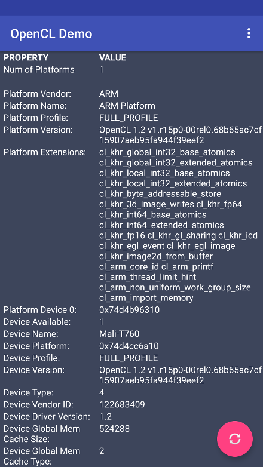

Andorid OpenCL Demo
===================

This folder contains an Andorid Project to demonstrate the usage of OpenCL.

For this project to work, you will need the Android SDK and NDK.
Further you will need to place your manufacturer/device specific version of the OpenCL ICD Library in the folder imported-lib/${ABI}/ for CMAKE to find it.

Tested with the following components:

- Android Studio 2.3.1
- Android 7.0 (Nougat) SDK (API Level 24)
- Android NDK 14.1

Most probably, you will have to pull the libOpenCL.so from your device. I used the following commands to find and pull the file from my Samsung Galaxy S6 Edge:

```
cd imported-lib/${ABI}/

adb ls /system/vendor/lib64/

...
000081a4 0000d860 4892fac0 libMcClient.so
000081a4 00006838 4892fac0 libOpenCL.so
000081a4 0003d948 58d8ba26 libHpr_LocLandmark_sdm_v1.0.so
000081a4 00d8ad88 58d8ba6d libOpenCv.so
...


adb pull /system/vendor/lib64/libOpenCL.so
```

Screenshot
----------
